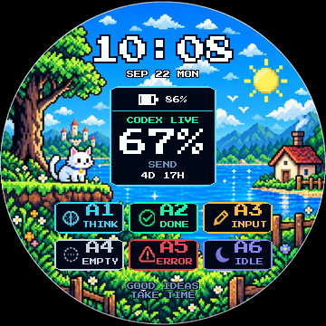

# Codex Micro for Waveshare ESP32-S3-Touch-LCD-1.85B



把 [digitsisyph/codex-micro-stopwatch](https://github.com/digitsisyph/codex-micro-stopwatch)
移植到 **Waveshare ESP32-S3-Touch-LCD-1.85B** 的原生 ESP-IDF 固件。
它把这块圆屏开发板变成 ChatGPT Desktop 的实体控制器：屏幕显示 Codex 状态、
额度、智能体和电池信息，触摸与 BOOT 键负责发送、选择智能体、语音和麦克风操作。

> 本项目是社区移植版，不是 OpenAI、M5Stack 或 Waveshare 的官方固件。

相关资料：[上游项目](https://github.com/digitsisyph/codex-micro-stopwatch) ·
[M5Stack StopWatch 文档](https://docs.m5stack.com/zh_CN/core/StopWatch) ·
[Waveshare 1.85B 文档](https://docs.waveshare.net/ESP32-S3-Touch-LCD-1.85B)

## 功能一览

- **360 × 360 像素仪表盘**：日夜主题、时钟日期、额度环、6 个智能体状态、连接健康度与完成提示。
- **ChatGPT Desktop 控制**：支持选择智能体、Send、四向滑动、Voice Chat 和 push-to-talk。
- **BLE HID + 私有遥测协议**：兼容 Codex Micro 的 JSON-RPC 分片协议，并上报真实电量。
- **网页配网**：首次启动自动开放 `CODEX-XXXX` 热点，通过手机或电脑浏览器写入 Wi-Fi。
- **自动校时**：联网后通过 SNTP 获取时间，默认显示 UTC+8。
- **电源状态识别**：读取 BQ27220 电量计，区分电池供电、外部供电和充电状态。
- **完成提示音**：使用 ES8311 + I2S 播放任务完成提示。
- **Windows 额度伴生程序**：读取本机 Codex 周额度，并通过 BLE 同步到表盘。
- **离线 UI 预览与回归工具**：无需烧录即可生成日间、夜间、离线、配网等界面截图。

## 快速开始

### 1. 准备环境

- Waveshare ESP32-S3-Touch-LCD-1.85B
- ESP-IDF 5.4 或更高版本（本仓库当前按 **v5.4.1** 验证）
- Python 3.10+
- Windows 10/11 + ChatGPT Desktop（需要使用实体控制功能和额度同步时）

仓库内的 `idf_env.bat` / `idf_env.sh` 使用的是当前开发机上的 ESP-IDF 路径。
如果你的安装位置不同，请先修改其中的 `IDF_TOOLS_PATH`、`IDF_PATH` 和
`IDF_PYTHON_ENV_PATH`。

### 2. 编译与烧录

Windows CMD 或 PowerShell：

```powershell
.\idf.bat build
.\idf.bat -p COM5 flash monitor
```

Git Bash：

```bash
source ./idf_env.sh
idf build
idf -p COM5 flash monitor
```

将 `COM5` 替换为开发板的实际串口。若修改过 `sdkconfig.defaults`，请先删除旧的
`sdkconfig`，再重新编译，让默认配置重新生效。

### 3. 首次配置 Wi-Fi

设备没有保存过 Wi-Fi，或连续连接失败时，会进入配网模式：

1. 在手机或电脑上连接屏幕显示的开放热点 `CODEX-XXXX`；
2. 浏览器打开 <http://192.168.4.1>；
3. 选择 2.4 GHz Wi-Fi，填写密码并保存；
4. 设备重启、联网并通过 SNTP 校时。

凭据只保存在设备 NVS 中，不会写入源码或提交到仓库。

### 4. 配对 Codex Micro

1. 打开 Windows“设置 → 蓝牙和设备 → 添加设备”；
2. 选择 **Codex Micro** 并完成配对；
3. 启动 ChatGPT Desktop，等待设备状态由离线变为可用；
4. 若旧固件曾与电脑配对，请先删除旧的 **Codex Micro** 记录再重新配对。

设备连接后仍显示“操作受限”时，先查看[蓝牙快速排障](#71-蓝牙连上了但不能操作怎么办)，
不要直接清除整片 Flash 或修改蓝牙地址。

### 5. 同步 Codex 额度（Windows）

先查出设备的实际 BLE 地址：

```powershell
python tools/ble_scan.py
```

验证本机额度读取，然后持续同步：

```powershell
python windows_companion.py --json-only -v
python windows_companion.py --device-address xx:xx:xx:xx:xx:xx --watch --interval 60 -v
```

把示例地址替换为你的设备地址。伴生程序复用本机 Codex 登录态，不需要 OpenAI API Key，
也不会把账号凭据发送到开发板。

## 常用配置入口

| 配置内容 | 文件 / 位置 | 默认值或说明 |
| --- | --- | --- |
| ESP-IDF、编译器与 Python 路径 | `idf_env.bat` / `idf_env.sh` | 当前开发机使用 ESP-IDF v5.4.1 |
| Flash、PSRAM、蓝牙、任务栈 | `sdkconfig.defaults` | ESP32-S3R8、16 MB Flash、8 MB Octal PSRAM |
| 屏幕、触摸、音频、按键引脚 | `main/board_config.h` | Waveshare 1.85B 官方 BSP 引脚映射 |
| 时区与 NTP 服务器 | `main/wifi_time.cpp` | UTC+8；双 NTP 服务器 |
| 亮度与自动息屏时间 | `main/main.cpp` | 电池：2 分钟变暗、5 分钟息屏；外部供电：10/30 分钟 |
| BLE 加密与调试日志 | `main/codex_ble.cpp` | `CODEX_BLE_REQUIRE_ENCRYPTION`、`CODEX_BLE_TRACE` |
| UI 布局、颜色和文案 | `main/dashboard_ui.h` | 360 × 360 圆屏布局 |
| 日夜背景与电池图标 | `main/assets/`、`main/Backgrounds.h`、`main/BatteryIcons.h` | 由 `tools/make_*.py` 生成 |
| 额度同步周期与重试 | `windows_companion.py` 命令行参数 | `--interval`、`--write-attempts`、`--write-timeout-ms` |

生成所有离线预览：

```powershell
python tools/pixel_preview.py --scene all
```

下面是硬件、协议、实现和排障的完整说明。

---

## 1. 硬件对照

| 项目 | C152 StopWatch Dev Kit | Waveshare 1.85B | 移植处理 |
| --- | --- | --- | --- |
| SoC | ESP32-S3R8 | ESP32-S3R8 | 相同，240 MHz / 8 MB Octal PSRAM / 16 MB Flash |
| 屏幕 | 466×466 CO5300 AMOLED | 360×360 ST77916 QSPI | 仪表盘按比例重排为 360×360 |
| 触摸 | CST9217 | CST816S | `espressif/esp_lcd_touch_cst816s` |
| 按键 | 左键 + 右键 + 红色电源键 | **仅 BOOT (GPIO0)** | 单键多手势，见第 4 节 |
| 电源 | M5PM1 PMIC | BQ27220 电量计 | 无 PMIC、无轨道断电 |
| 音频 | 内置喇叭 | ES8311 + I2S 功放 | 寄存器级 ES8311 驱动 |
| 震动马达 | 有 | 无 | 移除触觉反馈 |

### 引脚映射

| 功能 | GPIO |
| --- | --- |
| LCD CS / PCLK / D0 / D1 / D2 / D3 | 21 / 40 / 46 / 45 / 42 / 41 |
| LCD RST / 背光 | 3 / 5（LEDC CH1） |
| I2C SCL / SDA | 10 / 11（400 kHz，共享总线） |
| 触摸 RST / INT | 1 / 4 |
| I2S MCLK / BCLK / LRCK / DOUT / DIN | 2 / 48 / 38 / 47 / 39 |
| 功放使能 | 9 |
| 用户按键（唯一） | 0（BOOT，strapping 引脚） |

I2C 从机地址：ES8311 `0x18`（7 位；BSP 里写的 `0x30` 是 8 位形式）、BQ27220 `0x55`、CST816S `0x15`。

---

## 2. 显示与界面

- ST77916 QSPI，360×360，RGB565，80 MHz。上电先读寄存器 `0x04` 判断面板版本，
  再选用对应的厂商初始化表（v1 / v2）。
- 帧缓冲放在 PSRAM（259 KB），按 60 行一条分 6 条推屏，DMA 完成后由回调释放信号量。
- 布局（`main/dashboard_ui.h`）：
  - 中心 `(180, 180)`，外圈配额环半径 80 px；
  - 6 个智能体键均布在半径 42 px 的圆周上，角度 60° 间隔；
  - 配色：背景 `#000000`，正文 `#E8EEF5`，次要 `#7D8A98`，强调 `#12D6B2`。

---

## 3. 交互语义（与 C152 完全一致）

### 触摸

| 手势 | 动作 | 发往宿主的 JSON-RPC |
| --- | --- | --- |
| 点按 6 个智能体键 | 选中智能体 | `v.oai.hid` `{k:"AG00".."AG05", act:1, ag:i}` 再 `act:0` |
| 点按中央 Send | 发送 | `v.oai.hid` `{k:"ACT12", act:1}` 再 `act:0` |
| 向 4 个方向滑动 | 摇杆 | `v.oai.rad` `{a:角度, d:1.0}` 按下 / `{a:角度, d:0.0}` 松开 |
| 长按 Send ≥ 2 s | 显示关机进度 | — |
| 长按 Send ≥ 6 s | 熄屏（关机态） | — |

### 唯一的物理按键：BOOT (GPIO0)

**本板只有一个可定义按键**，因此全部手势都集中在它上面：

| 手势 | 动作 | 发出 |
| --- | --- | --- |
| **单击** | 息屏 / 唤醒（desk sleep 切换） | — |
| **双击** | Voice Chat 短按（对应 C152 右键） | `ACT09` 按下 → 70 ms → 松开 |
| **长按 ≥ 700 ms** | 麦克风对讲 push-to-talk（对应 C152 左键） | `ACT10` 按下，松手时 `ACT10` 松开 |

三点说明：

1. **没有独立电源键**。C152 的红色电源键功能改由触摸承担（长按 Send 6 s）。
2. **不使用 deep sleep**。唯一的用户按键 GPIO0 是 ROM 下载 strapping 引脚，
   deep sleep 唤醒会重新采样该引脚，可能把芯片带进串口下载模式而不是应用程序。
3. 因此"关机"是**背光关闭的空闲态**（屏幕黑、CPU 低频轮询），不是真正的断电。

---

## 4. 蓝牙（BLE）协议

Bluedroid 直接注册 GATTS/GAP（原版用的是 Arduino-ESP32 的 BLE 封装）。

| 服务 | UUID | 内容 |
| --- | --- | --- |
| Device Information | `0x180A` | 制造商 "Work Louder"、PnP ID `303A:8360` |
| HID over GATT | `0x1812` | 厂商报告 ID **6**，usage page `0xFF00`，报告体 63 字节 |
| Battery Service | `0x180F` | 电量通知 |
| 私有配额服务 | `7f0d4e66-2ac2-4a71-bfbe-4ef61a0e5c01` | 写入特征 `...5c02` |

设备名 `Codex Micro`，广播里带 `0x1812` / `0x180F` / 128 位配额服务 UUID。

### JSON-RPC 传输

走 **HID output report**，分片格式：

```
report[0] = 0x02
report[1] = 本次载荷长度
report[2..] = 载荷（换行符结尾，每片最多 61 字节）
```

- 入站方法：`sys.version`、`device.status`、`v.oai.thstatus`、`v.oai.rgbcfg`、
  `lights.preview`、`host.focused_app`
- 出站方法：`v.oai.hid`（`ACT09` / `ACT10` / `ACT12` / `AG00`..`AG05`）、
  `v.oai.rad`（摇杆）

写入默认要求加密链路。首次配对调试时可以用
`-DCODEX_BLE_REQUIRE_ENCRYPTION=0` 先建立明文链路。

### ⚠️ 首次使用必须让主机重新配对

配额特征 `...5c02` 与 HID 输入报告都是**加密访问**，所以链路必须先完成配对。
如果主机里留着一条**旧绑定**（例如板子重新烧录过、NVS 被清过），
主机就会一直拿旧密钥去恢复加密、又一直失败，表现是**连上就断、额度永远同步不了**。
详细日志分析见第 6.6 节。

因此本工程给板子用了一个**从出厂 MAC 派生出的独立蓝牙地址**
（`codex_ble.cpp` 里的 `esp_base_mac_addr_set()`），主机因此会把它当成一台新设备，
不会再复用那条坏掉的绑定。第一次使用请：

1. Windows：设置 → 蓝牙和其他设备 → **添加设备** → 选择 **Codex Micro**，完成配对；
2. 如果列表里还留着旧的 **Codex Micro** 条目（连不上的那条），顺手删掉即可；
3. 配对完成后串口会打印 `ble: pairing complete`，之后链路会一直保持。

已经连过一次、绑定正常的情况下不需要做这些，断电重连会自动恢复。

### 调试开关

| 开关 | 位置 | 作用 |
| --- | --- | --- |
| `CODEX_BLE_REQUIRE_ENCRYPTION` | `main/codex_ble.cpp` | 置 0 可让 HID / 配额特征接受明文读写，用于排除配对问题 |
| `CODEX_BLE_TRACE` | `main/codex_ble.cpp` | 置 1 并开启 `CONFIG_LOG_MAXIMUM_LEVEL_DEBUG`，打印 HCI / SMP / ATT 细节 |

---

## 5. 构建与烧录

本工程用的是本机已装好的 ESP-IDF v5.4.1，未新增任何环境。

```bash
# 1) 载入 IDF 环境（脚本只做 PATH / 变量设置，不安装任何东西）
source ./idf_env.sh

# 2) 编译
idf build

# 3) 烧录（把 COM5 换成实际串口）
idf -p COM5 flash

# 4) 看日志
idf -p COM5 monitor
```

`idf_env.sh` 里做了两件必要的适配：

- PATH 条目刻意使用 Windows 反斜杠形式 —— MSys 会重写 POSIX 形式的条目，
  把 `D:/Espressif/...` 破坏成错误的相对路径；
- `idf_runner.py` 在启动 `idf.py` 前剔除 `MSYSTEM` / `MINGW_*`，
  否则 `idf.py` 会因为检测到 MSys 而拒绝启动。

### 关键配置（`sdkconfig.defaults`）

| 配置 | 值 | 原因 |
| --- | --- | --- |
| `CONFIG_ESP_MAIN_TASK_AFFINITY_CPU1` | y | 主任务与蓝牙栈分核，见第 6 节 |
| `CONFIG_ESP_MAIN_TASK_STACK_SIZE` | 12288 | 全屏绘制栈需求较大 |
| `CONFIG_BT_CTRL_LE_PING_EN` | **n** | 关闭认证载荷超时，见第 6 节 |
| `CONFIG_BT_SMP_MAX_BONDS` | 8 | 配对信息存 NVS |
| `CONFIG_BT_STACK_NO_LOG` | n | 保留控制器告警，便于排障 |
| `CONFIG_ESP_CONSOLE_USB_SERIAL_JTAG` | y | 用原生 USB-C 口看日志 |

> ⚠️ 改了 `sdkconfig.defaults` 之后请**删掉 `sdkconfig` 再编译**。
> ESP-IDF 只在生成新 `sdkconfig` 时套用 defaults，已存在的 `sdkconfig`
> 会覆盖 defaults，这正是下面第 6.4 条那个 bug 的成因。

---

## 6. 移植过程中修掉的问题（调试记录）

按发现顺序列出，都是实测复现过的。

### 6.1 GATT 注册失败：`attribute table failed: 0x85`

`esp_ble_gatts_create_attr_tab()` **一张表只允许一个主服务**。
`btc_gatts_check_valid_attr_tab()` 在遇到第二个 `0x2800` 服务声明时直接返回
`ESP_GATT_ERROR (0x85)`。原先把 DIS + HID + 电池 + 配额四个服务塞进一张表，
结果整张表注册失败，广播正常但**一个服务都没有**。

**修复**：拆成 4 张表，在 `ESP_GATTS_CREAT_ATTR_TAB_EVT` 里串行注册下一张
（Bluedroid 内部只有一个"正在建表"的全局状态，必须串行）。现在日志为：

```
ble: service 0 registered (5 attributes)
ble: service 1 registered (16 attributes)
ble: service 2 registered (5 attributes)
ble: service 3 registered (3 attributes)
ble: GATT database registered (4 services, 29 attributes)
ble: handles input=55 output=59 battery=63 quota=68
```

### 6.2 建表时 NULL 解引用，`LoadProhibited` 重启循环

表校验通过之后，`BTA_GATTS_AddCharacteristic()` 会
`memcpy(dst, attr_val->attr_val, attr_len)`。属性项的字段顺序是
`{uuid_length, uuid_p, perm, max_length, length, value}`，其中 `length` 是
**初始值长度**。HID Control Point 那项写成了 `length = 1, value = nullptr`，
于是从 NULL 拷贝 1 字节 → 崩溃重启（约 1.7 秒一轮）。

原先这个 bug 被 6.1 掩盖了（表根本没建起来，走不到这条路）。
**修复**：给 `length > 0` 的属性都提供真实缓冲区。

### 6.3 CST816S 每次轮询都 NACK

`esp_lcd_touch_cst816s` 驱动不会关闭自动休眠。CST816S 进入 auto-sleep 后
I2C 不再应答，日志刷满 `I2C read failed` / `unexpected nack`（实测 20 秒内 273 次），
只有真正触摸时才偶发成功。Waveshare 参考驱动在复位后会写
`0xFE (DisAutoSleep) = 10`。

**修复**：初始化后补写该寄存器。现在启动日志为
`touch: CST816S ready, auto-sleep disabled`，NACK 归零。

### 6.4 主任务与蓝牙栈抢同一个核

`sdkconfig.defaults` 里写了 `CONFIG_ESP_MAIN_TASK_AFFINITY_CPU1=y`，
但已存在的 `sdkconfig` 是在这行加入**之前**生成的，defaults 被忽略，
实际值是 **CPU0** —— 和整个蓝牙栈（控制器 + Bluedroid + BTC/BTU）同核。
仪表盘整屏重绘 + QSPI 推屏会长时间占住这个核，控制器来不及处理连接事件。

**修复**：删掉 `sdkconfig` 重新生成（同时让 `CONFIG_BT_SMP_MAX_BONDS` 等
其他 defaults 真正生效），主任务落到 CPU1。

### 6.5 蓝牙反复掉线（`reason=0x08`，每 7~20 秒一次）

现象：连上后稳定若干秒必然断开，控制器报
`BT_HCI: hcif disc complete: hdl 0x1, rsn 0x8`，随后自动重连，如此循环。
`0x08` 是**链路层 supervision timeout**，间隔极其稳定（实测 16.9 / 16.9 / 17.0 秒，
以及 6.9 / 7.0 / 7.0 秒），说明是固定定时器而不是射频干扰。

定位过程中发现日志里的关键线索：

```
I (5203) ble: link params interval=12ms latency=0 timeout=7000ms status=16
```

`status=16` 是 `ESP_BT_STATUS_TIMEOUT` —— 我们主动发的 L2CAP 连接参数更新请求
**主机根本没回应**。

**真正的根因是两处多余的控制器操作：**

1. **在连接事件里调用 `esp_ble_gap_start_advertising()`**。
   原注释说是为了让伴侣设备再建第二条连接，但在已连接状态下重启广播会让控制器
   无法正常服务当前连接，几秒后链路就被判超时。
2. **在连接事件里调用 `esp_ble_gap_update_conn_params()`**。
   Windows 不回应这个请求，白等一个超时，只是增加抖动。

**修复**：连接时不再动广播（重连由断开事件负责），也不再主动请求连接参数，
交给主机决定（Windows 自己给的就是 12 ms 间隔 / 0 延迟，本来正合适）。

**阶段性实测**：移除这两项操作后，120 秒观察窗口内出现过 0 次断开；但进一步
打开 SMP/HCI 日志后发现，旧绑定僵死才是当前主机持续断开和额度不同步的决定性原因，
见下一节。不要把短窗口里的"0 次断开"误判为已经完成配对修复。

> 另外，`CONFIG_BT_CTRL_LE_PING_EN` 也一并关掉了（默认 y）。它的说明是
> "用于解决某些 LE ping 相关的兼容性问题"，开启时控制器会跑认证载荷计时器，
> 空闲链路上容易触发拆链。关掉它可以减少一类空闲掉线来源。

> ⚠️ **本节不是最终结论。** 把这里的两处操作都修掉之后，链路仍然按固定节奏断。
> 真正的根因是 Windows 允许把蓝牙网卡降功耗，见 **6.14**。

### 6.6 配对僵死：主机留着旧绑定，导致链路秒断 + 额度无法同步

这是**额度同步不了**的直接原因。

打开蓝牙栈日志后（`CONFIG_LOG_MAXIMUM_LEVEL_DEBUG` + 把 `BT_HCI` / `BT_BTM` /
`BT_APPL` 等标签设为 DEBUG），每次连接都会出现：

```
I (3846) ble: connected peer e0:0a:f6:80:71:d2      ← 就是本机蓝牙网卡的地址
I (3847) ble: host connected id=0
W (3862) BT_APPL: bta_dm_ble_smp_cback remove bond, rsn 102, BDA:0xE00AF68071D2
E (3862) BT_BTM: Device not found
W (3863) BT_HCI: hcif disc complete: hdl 0x1, rsn 0x13
I (3863) ble: host disconnected id=0 reason=0x13
W (3863) BT_BTC: btc_dm_ble_auth_cmpl_evt, remove bond in flash bd_addr: e00af68071d2
W (3864) ble: pairing failed reason=0x66
```

- `0x66 (102)` = `ESP_AUTH_SMP_CONN_TOUT`，即配对过程因链路问题失败；
- `0x13` = 主机主动断开；
- Bluedroid 顺手把本地绑定记录删掉了，`Device not found` 说明本来就没有记录。

**成因**：主机（Windows）仍然保存着这条设备的绑定和 LTK，而板子这边的绑定已经不存在了
（重新烧录、NVS 被清、或固件换过）。主机连上后直接尝试用旧 LTK 恢复加密，
板子拿不出对应密钥 → SMP 失败 → 主机判定安全建立不了 → 秒断并循环重试。

**为什么这会让额度同步不了**：配额特征 `...5c02` 的权限是
`ESP_GATT_PERM_WRITE_ENCRYPTED`，HID 输入报告也是加密读。加密永远建立不起来，
伴侣程序的写入就一直被拒，所以额度永远同步不了。

**处理**：

1. **首选（一次性）**：在主机上删掉这条设备的配对，让它重新配对一次。
   Windows：设置 → 蓝牙和其他设备 → 找到 **Codex Micro** → 删除设备。
   然后板子会自动重新配对，加密链路建立，额度即可同步。
2. **固件侧规避（本版本已启用）**：本工程给板子使用了一个**从出厂 MAC 派生出的独立蓝牙基址**
   （见 `codex_ble.cpp` 中 `esp_base_mac_addr_set()` 那段，`kBondGeneration` 常量）。
   实际 BLE 地址是该基址**再加 2**（出厂 MAC 末字节 `0x2C`，基址 = `0x2C ^ gen`，
   广播地址 = 基址 + 2）。例如 `gen=0x5A` → 基址 `…:76` → 广播 `…:78`；
   `gen=0x5B` → 基址 `…:77` → 广播 `…:79`。
   主机是按地址保存绑定的，换个地址就等于换了一台新设备，主机就会重新配对，
   从而不必手动"删除设备"。同一代次内地址每次启动都一样，所以绑定之后能一直保留。

   > 主机侧一旦卡在"记录还在、但报未配对、又拒绝重新配对"的状态，
   > `--repair-pairing` 也救不回来，此时唯一的出路是把 `kBondGeneration` 加一
   > 重新烧录。详见 6.13。

> 顺带记一条**反面结论**：曾经试过把连接时的 `esp_ble_set_encryption()` 去掉，
> 想让主机自己发起配对。结果更糟 —— 主机连上后 15 ms 内就断开（`0x13`），
> 75 秒内断了 67 次。说明主机确实是一连上就要求加密，**不能**省掉这一步。

### 6.7 熄屏态用 light sleep 不安全（重启来源）

`enterPowerOff()` 原本调用 `esp_light_sleep_start()`，但本工程
`CONFIG_PM_ENABLE` 是关闭的，而且 `CONFIG_SPIRAM_XIP_FROM_PSRAM=y`
（代码从 PSRAM 执行）。light sleep 会把 PSRAM 断电，唤醒时 CPU 可能先取指到
已被断电的 PSRAM —— 这是实打实的重启来源。

**修复**：熄屏态改为**背光关闭 + 低频轮询空闲**。背光本来就是主要功耗，
而且这样还能让已建立的 BLE 链路在熄屏时继续存活。

### 6.8 启动时打印复位原因

`app_main()` 开头会输出**上一次**重启的原因，并存在 RTC 内存里跨复位保留
（断电清空，用 magic word 判断有效性）：

```
W (621) app: PREVIOUS BOOT ENDED BY: BROWNOUT (supply sagged) (boot #7)
I (622) app: reset reason: software
```

这样遇到"无缘无故重启"时，串口日志能直接告诉你是
brownout / panic / 看门狗 / 软复位中的哪一种。

### 6.9 Windows 上额度写不进去：PowerShell 命令行超长（`WinError 206`）

**症状**：`--json-only` 能正常读到额度，但真机写入那一步直接抛异常，板子串口
**完全没有** `quota update` 日志。

```
FileNotFoundError: [WinError 206] 文件名或扩展名太长。
```

**根因**：Windows 端口用 `powershell.exe -EncodedCommand <base64(UTF-16LE)>` 来跑
WinRT/`AsTask` 桥。`-EncodedCommand` 是 UTF-16LE 再 base64，等于源码的 **2.67 倍**：

| 量 | 长度 |
| --- | --- |
| 桥接脚本源码 | ~13 500 字符 |
| base64(UTF-16LE) | ~36 200 字符 |
| Windows `CreateProcess` 命令行上限 | **32 767 字符** |

所以 PowerShell 进程根本没能启动，额度一次都没写出去。脚本在 9/18 之后变长，
越过了这条线，于是"以前能探测、现在连探测都失败"。

**修复**：脚本本身是纯 ASCII（`build_ps_bridge()` 里有 `isascii()` 断言），
所以改成**落盘成 ASCII 临时 `.ps1`，用 `-File` 调用**，并保留
`-EncodedCommand` 作为小脚本的兜底（超长时明确报错而不是崩）。临时目录非
ASCII 时会拒绝落盘，避免 PowerShell 5.1 按 ANSI 解码把脚本读坏。

修复后实测（同一块板，同一次写入）：

```
[ble] {"event": "services", "status": "Success", "count": [1, 1, 1, 1, 1, 1]}
[ble] {"event": "quota_characteristic", "uuid": "7f0d4e66-...-5c02",
       "properties": "WriteWithoutResponse, Write", "handle": 67}
[ble] {"event": "write_ack", "status": "Success"}
```

板子串口对应收到：

```
I (1168684) ble: quota update remaining=0.0 reset=15649s
```

> 如果 `--probe-only` 报 `GATT service discovery returned Unreachable`，
> 那是另一个问题（主机 GATT 缓存/绑定过期），先按 6.6 重新配对；本次修复后
> 同一台机器上服务发现已经稳定返回 `Success`。

### 6.10 仪表盘显示 0% 不等于故障

Codex 的 `account/rateLimits/read` 一次返回**两个**窗口：

| 槽位 | `windowDurationMins` | 含义 | 本机实测 |
| --- | --- | --- | --- |
| `primary` | 300 | 5 小时滚动窗口 | 已用 1% → 剩余 **99%** |
| `secondary` | 10080 | 周窗口（7 天） | 已用 100% → 剩余 **0%** |

上游 macOS companion 读的是 **`primary`（5 小时）**；本 Windows 端口按
"表盘显示周额度"的定位读的是 **周窗口**（按 `windowDurationMins == 10080`
识别，不按槽位名，因为槽位在不同套餐下会互换）。

所以当周额度用尽、而 5 小时窗口还有余量时，表盘显示 **0%** 是**正确数据**，
不是 bug。想让表盘改看 5 小时窗口，把 `build_snapshot()` 里的
`select_weekly_window()` 换成 `bucket["primary"]` 即可。

### 6.11 Windows GATT 缓存导致写入间歇失败（`AccessDenied` / `ERROR_CANCELLED`）

6.9 修完之后额度能写进去了，但**时好时坏**：同样一条命令，有时一次成功，
有时连续 3~4 次全败。板子侧证据很干净——**ATT 写 PDU 从来没上过空**：

| 现象 | 证据 |
| --- | --- |
| 板子收不到写 | 串口里没有 `quota update`，也没有 `write ... (unhandled)` |
| 板子链路本身是好的 | 电池通知 `gatt conf status=0` 连续 20/20 正常 |
| 失败在主机侧 | `ERROR_CANCELLED (0x800704C7)` / `AccessDenied` / 30 秒超时 |
| 失败会拖垮板子 | 写卡住 30 秒后板子报 `gatt conf status=143`（`ESP_GATT_CONGESTED`），之后通知永久失败直到重建链路 |

**根因**：Windows 默认用**缓存模式**回答 GATT 发现。这个缓存按设备保存，
**重新配对也不会失效**，而本固件在移植过程中改过属性表（加了电池 CCCD、
放宽了 quota 权限）。缓存与真实属性表不一致时，Windows 就会在
`GetCharacteristicsAsync` 返回 `AccessDenied`、在写入时抛
`ERROR_CANCELLED`。

**修复**（`windows_companion.py`，三处）：

1. **服务/特征发现改用 `BluetoothCacheMode::Uncached`**，绕过过期缓存；
   若该 Windows 版本不认这个重载（本机实测特征发现会返回
   `0x80070016` = `ERROR_BAD_COMMAND`），自动回落到缓存调用并记一条
   `cache_mode` 事件。这一条是决定性的：改前约 0~50% 成功，改后连续
   **3/3 一次成功**。
2. **写入超时 30 s → 12 s**（`--write-timeout-ms`）。30 秒的卡死会把板子
   推进 `ESP_GATT_CONGESTED`，缩短后即使失败也不会污染板子状态。
3. **失败重试，每次全新会话**（`--write-attempts`，默认 4，退避 3/8/15 秒）。
   每次重试都是新的 PowerShell 进程，因此拿到全新的 `BluetoothLEDevice`
   和 GATT 会话——这正是 `ERROR_CANCELLED` 需要的，因为它是针对**过期会话**
   报的，在同一进程内重试只会反复失败。

顺带修掉两个桥接自身的 bug：

- `Emit-Event` 原本用 `Write-Output`，在函数内部会把事件字符串混进该函数的
  返回值，导致 `Invoke-WriteAsync` 返回一个数组而非状态，**让整条多策略
  回退链从未被执行**。改用 `[Console]::Out.WriteLine` 绕开管道。
- 失败信息读的是 `$writeResult.Status`，而反射路径上该变量未赋值，
  于是错误信息尾部为空（`"GATT write returned "`），真正的状态被吞掉。
  改为上报实际观察到的 `$writeStatus`。
- `Await-Op` 现在会剥掉 `AggregateException`，暴露出最内层原因——正是这样
  才看到 `ERROR_CANCELLED` 而不是无用的"发生一个或多个错误"。

> 连续实测（同一条命令、间隔 4 秒）：**3/3 成功**，板子侧
> `quota update remaining=0.0 reset=13700s`，与载荷
> `reset_in_seconds=13700` 完全一致，35 次通知零拥塞。

### 6.12 蓝牙连上了但 Codex 界面没反应：HID 通知 CCCD 没使能

**症状**：BLE 连接正常、主机还在持续发 RPC（串口能看到
`RPC method=v.oai.thstatus` / `device.status`），但按键和触摸**完全不起作用**，
Codex 界面毫无反应。

**根因**：设备 → 主机的一切都走 HID input report 特征（句柄 55）的 notify。
但那个特征的 CCCD（`s_cccd`）初值是 **`0x00 0x00`，即未使能通知**。
Bluedroid 在把通知放上空中之前会先查这个描述符：值为 0 时通知被**本地确认后丢弃**
（`ESP_GATTS_CONF_EVT` 仍报 `status=0`，看起来一切正常），根本没有离开芯片。

这**不是新问题**——固件早就为电池 CCCD 踩过同一个坑，注释里写得明明白白
（"Windows does not subscribe to the battery CCCD for a HID-only device, so arm
it here instead of waiting for a write that never comes"），电池已经预置成
`{0x01, 0x00}` 修好了，**HID 的却漏了**。实测佐证：

- 全部串口日志里**从来没有** `hid cccd` 这一行 → 主机从未写过这个描述符
- 电池（已预置）的 `gatt conf handle=63 status=0` 一直正常
- HID input（未预置）的通知同样报 `status=0`，但主机侧什么都没收到

**修复**：把 HID input CCCD 也预置为使能，放在 `CODEX_BLE_HID_CCCD_PREARMED`
宏后面（默认 1，置 0 可回退到旧行为）。同时给 `sendJson()` 加了诊断日志：

```
I (…) ble: sendJson chunks=3 failed=0 bytes=143 cccd=0x0001
```

`cccd=0x0001` 表示通知真的会上空中；如果是 `0x0000`，上面那些 chunk
就是被本地丢弃的——这一行让"静默丢弃"第一次变得可见。早退路径
（`json==nullptr` / `handle==0` / `!connected()`）也会打 WARN，
不再和"主机不理我们"混为一谈。

### 6.13 绑定代次（`kBondGeneration`）：主机卡在"未配对"时的唯一出路

`codex_ble.cpp` 里的 `kBondGeneration`（当前 `0x5B`）是主机侧配对卡死时的
**唯一可操作旋钮**。

主机按地址记绑定。当主机留着一条记录、却把它报成
`IsPaired=false` 并且**拒绝发起新配对**时，会形成死锁：

| 现象 | 说明 |
| --- | --- |
| `--repair-pairing` 返回 `Failed` | `Pairing.IsPaired=false`，没有东西可解绑，`PairAsync` 也起不来 |
| 板子串口完全没有连接事件 | 主机根本没发起连接 |
| 板子一直在广播 | 广播是 `ADV_FILTER_ALLOW_SCAN_ANY_CON_ANY`，没有白名单，问题不在板子 |
| Windows 里查不到该设备 | 新地址对 Windows 完全陌生，`FromBluetoothAddressAsync` 返回 null |

**解法**：把 `kBondGeneration` 加一，重新编译烧录。板子会广播一个**新地址**，
主机把它当成全新设备，配对即可成功——这正是固件原注释里描述的逃生路径，
现在把它做成了显式常量。

> ⚠️ **不要把启动日志里的地址当成设备地址用。**
> 那行打印的是**基址 MAC**（`base MAC set to …`），控制器会在此基础上派生
> 真正广播的地址，二者并不相同（实测基址 `…:77` → 广播 `…:79`）。
> 启动日志里那行现在会明确写出这一点。

**相关工具**：

```bash
# 清掉板子自己的绑定（NVS 在 0x9000，长度 0x4000）
python -m esptool --chip esp32s3 -p COM5 erase_region 0x9000 0x4000

# 列出 Windows 已知的 BLE 设备（确认主机到底认不认得这块板子）
python tools/ble_scan.py
```

### 6.14 掉线的真正来源：Windows 允许把蓝牙网卡断电

6.5 节把"空闲掉线"归到 `LE_PING` 和连接事件里多余的控制器操作上。那些确实是
问题，但**不是本机持续掉线的原因**——把它们全部修掉之后，链路依然按固定节奏断。

**实测**：空闲时每 **32.88 秒**断一次，控制器报 `reason=0x08`；而协商到的
supervision timeout 正好是 **32000 ms**（`link params … timeout=32000ms`）。
也就是说控制器报的是**规范要求它报的东西**：连续 32 秒没收到主机的任何包，
它只能判定链路已死。

反过来，**只要有一个 GATT 客户端挂着，就一次都不掉**：`--probe-only` 的
60 秒和 100 秒保持测试，断开次数都是 0。差别在于"设备正在被使用"。

顺着这条线索查电源策略（`tools/bt_power_repair.py`）：

```
MAY BE POWERED DOWN
    radio: Realtek Bluetooth Adapter
    USB\VID_0BDA&PID_4852\00e04c000001_0
MAY BE POWERED DOWN
    board: Bluetooth Low Energy GATT compliant HID device
    BTHLEDevice\{00001812-…}_Dev_VID&02303a_PID&8360_…_288485b21c79\…
```

**根因**：Windows 允许在空闲时把蓝牙网卡降功耗（Realtek USB 网卡，
`VID_0BDA&PID_4852`）。没有 GATT 客户端时，网卡被降下去就不再发包，板子等满
32 秒的 supervision timeout 后拆链；Windows 随即重连，如此循环。

**旁证**：`codex_host_state.py` 还查出 Windows **确实**给板子建了 HOGP 节点
（名字就叫 `Bluetooth Low Energy GATT compliant HID device`）。所以"连上了但
Codex 界面没反应"**不是 HID 没枚举出来**，而是链路每 32.88 秒被拆一次，
HID 接口根本无法稳定工作。

**修复**（需要管理员权限，会改系统设置）：

```bash
# 先看现状（不需要管理员）
python tools/bt_power_repair.py

# 在"以管理员身份运行"的终端里执行
python tools/bt_power_repair.py --apply     # 关掉网卡与板子节点的"允许关闭以省电"
python tools/bt_power_repair.py --restore   # 还原
```

等价的手工操作：设备管理器 → 蓝牙 → `Realtek Bluetooth Adapter` → 属性 →
电源管理 → 取消勾选"允许计算机关闭此设备以节约电源"，对板子的 HID 节点同样处理。

**不需要管理员的临时绕过**：让伴生程序一直挂着（`--watch`），或者用
`--probe-only` 保持链路——只要有 GATT 客户端在，网卡就不会被降功耗。

### 6.15 重启后额度显示 `--`：快照没有持久化

额度快照原本只存在 RAM 里，一断电就没了，于是每次开机表盘都先显示
`--` / `NO QUOTA`，要等伴生程序推一次才有数——这就是"每次都要等一会"的来源。

**修复**：把最近一次额度快照写进 NVS（命名空间 `codex`，键 `q_pct_x10` /
`q_reset_s`），启动时读回来。

```cpp
if (loadQuotaSnapshot(state_.quota)) { … }   // begin() 里，nvs_flash_init() 之后
```

板子没有 RTC，无法知道断电期间过了多久，所以**恢复出来的快照一律按 `STALE`
渲染**（数值用暗色 + 下方显示 `STALE`），而不是编造一个倒计时。
`QuotaState::restored` 就是这个标记，第一次收到真实写入时清掉。

### 6.16 "连上了但不能操作"的真正原因：主机侧的绑定残留

这一节是整个移植里最关键的一次定位，结论是：**协议实现是对的，坏的是配对状态。**

#### 桌面端到底怎么找这块板子

从 `app.asar` 里挖出来的 `wl_device_comm` / `hid-topology-watcher` 说明：

| 条件 | 值 |
| --- | --- |
| HID 接口 `usagePage` | 必须是 `0xFF00` |
| `productId` | 必须是 `33632`（`0x8360`），`CreatorMicroV2` 是 33431/33432 |
| 连接方式 | `node-hid` 直接打开 Windows 的 HID 设备节点，**不是**自己建 GATT 连接 |

主机→设备的每一帧是 **64 字节 HID 输出报告**：

```text
[0] = 6        report id（被 HID 栈吃掉，不会出现在空中）
[1] = 2        channel（CHANNEL_RPC）
[2] = n        载荷长度 0..61
[3..] = n 字节 UTF-8 JSON
```

`report id` 被剥掉之后剩下的 63 字节正好是本固件使用的报文体——两边的
分帧完全一致，这一点已逐字节核对过。

握手顺序是 `v.oai.rgbcfg` → `v.oai.thstatus` → `device.status`，任何一步拿不到
回复，桌面端就判定设备不可用。

#### 怎么看到桌面端的真实报错

桌面端自己的日志（MSIX 打包应用，路径被重定向过）：

```text
%LOCALAPPDATA%\Packages\OpenAI.Codex_2p2nqsd0c76g0\LocalCache\Local\Codex\Logs\<年>\<月>\<日>\
```

出问题时那里刷的是：

```text
error [CodexMicroService] "Connecting with HID"
error [CodexMicroService] Cannot write to hid device:
        hid_write/GetOverlappedResult: (0x00000057)
error [CodexMicroService] could not read from HID device:
        hid_read_timeout/GetOverlappedResult: (0x0000048F)
```

`0x57` = `ERROR_INVALID_PARAMETER`，`0x48F` = `ERROR_DEVICE_NOT_CONNECTED`。

#### 根因：绑定两半不一致，链路始终没加密

BLE 绑定有两半：主机按地址存一半，板子按对端地址存一半。任一侧重新烧录、
擦 NVS 或换地址，两半就对不上。Windows 对这种情况的处理最差——它留着一条
记录、把它报成**未配对**，同时又**拒绝重新配对**，于是：

1. 链路能建起来（Windows 里显示"已连接"，`ble_devices.py` 却报 `unpaired`）；
2. **SMP 永远不成功，链路始终不加密**；
3. 本固件的 HID 报告特征值要求加密（`READ_ENCRYPTED` / `WRITE_ENCRYPTED`），
   于是主机的输出报告写入被本地拒掉 → `0x57`；
4. **电量特征值本来就是明文可读的**（`ESP_GATT_PERM_READ`），所以
   "蓝牙能读电量，但什么都干不了"——这正是用户看到的现象。

板子侧串口能直接看到这个差异：**一次复位之后**立刻出现

```text
I (13473) ble: host connected id=0
I (13624) ble: pairing complete        ← 这次配对成功了
I (13673) ble: mtu id=0 value=517
I (42893) ble: RPC method=v.oai.rgbcfg ← 桌面端的 RPC 真的到了
```

而坏的时候只有 `conns=1` + 每秒的电池心跳，**一条 ATT 读写都没有**。

#### 修复：一次性清掉板子这半

上游 `src/CodexMicroBle.cpp` 有 `clearIncompatibleBondsOnce()`，本移植一直没实现。
现在补上：

```cpp
constexpr uint8_t kBondRevision = 2;   // NVS 键 codex/bond_rev，只在版本变化时清一次
```

在 `esp_bluedroid_enable()` 之后、任何连接之前调用，**只清一次**（版本号存在 NVS 里，
否则每次开机都逼主机重新配对）。清掉之后主机拿旧 LTK 来恢复加密会吃到
"PIN or key missing"，SMP 会删掉旧记录重新做一次 Just Works 配对。

> ⚠️ **不要把 `kBondGeneration` 一起改。** 一开始把代次从 `0x5B` 改成 `0x5C`、
> 想让 Windows 把板子当新设备重新配对，实测**更糟**：改地址后连续复位两次、
> 135 秒内 `conns=0`，主机一次都没连上来。
>
> 原因是 Windows 的 `BthLEEnum` 设备节点是按**地址**建的，那个节点才是
> "主机自己会重连"的依据。换了地址等于让 Windows 彻底没见过这块板子，
> 而桌面端的重扫只在 HID 拓扑变化时发生——板子没有 HID 接口就不会有拓扑变化，
> 于是变成死锁。**地址不动，只清绑定**才是对的。

#### 复现与验证工具

```bash
# 看 Windows 为这块板子推导出的 HID 能力（应为 input=64B output=64B，usagePage=0xFF00）
python tools/hid_caps.py --write-test

# 按桌面端的字节格式发一条 RPC，并读回包（不依赖桌面端，可单独验证固件）
python tools/hid_rpc.py --method sys.version --listen 5

# 复位板子并从第一行开始抓串口（普通抓法必然漏掉启动横幅）
python tools/serial_reset_capture.py COM5 60
```

> ⚠️ `hid_caps.py` 匹配路径时不能要求 `VID_303A` 这种大写形式：BLE HID 的设备接口
> 路径是小写且带 PnP 来源前缀的（`hid#{00001812-…}_dev_vid&02303a_pid&8360_…`）。

#### 最后卡住的那一层：Windows 蓝牙栈假死

绑定清理做完之后仍然连不上，而且这次**连链路都建不起来**——不是"连上但不能操作"，
是"根本连不上"。判别方法很干脆：

| 检查 | 坏的时候 |
| --- | --- |
| `--probe-only` | `the GATT session never became Active`，`link_established=Disconnected` |
| `--repair-pairing` | `can_pair=false`，`unpair=Unpaired` 成功，但 `pair=Failed`，`connection_status=Disconnected` |
| 板子串口 | 整段只有电池心跳，**一条 `host connected` 都没有** |
| `bt_radio_toggle.py --status` | 无线电状态是 `On`——不是被关掉了 |

主机侧枚举出来的东西全都正常：`BTHLE\DEV_288485B21C79` 在、`BthLEEnum` 状态 OK、
电源策略是 `disabled (radio stays on)`。可它就是不发连接。

**根因是 Windows 蓝牙栈在长时间反复连/断之后假死。** 桌面端之前刷了几十次
`Connecting with HID` → `WRITE_FAILED` → 断开，最后把主机这侧的栈拖进了不再发起
连接的状态。

**解法：把蓝牙无线电关掉再打开。**

```bash
python tools/bt_radio_toggle.py --status   # 只看状态，什么都不改
python tools/bt_radio_toggle.py            # 关 → 等 4 秒 → 开
```

用的是 WinRT `Radio.SetStateAsync`，也就是设置里那个开关，**不需要管理员**。
代价是几秒钟内所有蓝牙设备都会断（耳机、鼠标），所以它是独立工具，
伴生程序永远不会自己调用。

实测切换之后立刻恢复，板子串口一次到位：

```text
I (184756) ble: connected peer e0:0a:f6:80:71:d2
I (184756) ble: host connected id=0
I (184756) ble: mtu id=0 value=517
I (192344) ble: pairing complete        ← 绑定清掉之后重新配对成功
I (192361) ble: read id=0 handle=68 …   ← 服务发现
```

**不需要重启桌面端**：HID 接口一出现，它的 `hidTopologyWatcher` 就会触发，
桌面端自己完成了 `v.oai.rgbcfg` → `v.oai.thstatus` → `device.status` 的握手，
之后每 60 秒轮询一次 `device.status`，全部拿到回复。

#### 又一层：peripheral 主动发起 SMP 会把链路打进死循环

上一条修好之后，为了让"连上"和"可操作"之间少一个等待窗口，一度在
`ESP_GATTS_CONNECT_EVT` 里加了这一句：

```cpp
esp_ble_set_encryption(param->connect.remote_bda, ESP_BLE_SEC_ENCRYPT);
```

**它会让情况更糟，已经删掉了。** 原因是 IDF 的实现
（`stack/btm/btm_ble.c` 的 `btm_ble_set_encryption()`）：

```c
case BTM_BLE_SEC_ENCRYPT:
    if (link_role == BTM_ROLE_MASTER && (p_rec->ble.key_type & BTM_LE_KEY_PENC)) {
        cmd = btm_ble_start_encrypt(bd_addr, FALSE, NULL);
        break;
    }
/* if salve role then fall through to call SMP_Pair below */
case BTM_BLE_SEC_ENCRYPT_NO_MITM:
case BTM_BLE_SEC_ENCRYPT_MITM:
    ...
    if (SMP_Pair(bd_addr) == SMP_STARTED) { ... }
```

peripheral 恒为 `BTM_ROLE_SLAVE`，第一个分支**永远不成立**，于是每次都
fall through 到 `SMP_Pair()`——板子在连接事件之后几微秒就发 SMP Security
Request。对端如果还持着旧 bond 就什么都不回，SMP 失败、Bluedroid 删 bond、
主机断链、立刻重连，1~2 秒一轮：

```text
I (3236) ble: host connected id=0
W (3251) BT_APPL: bta_dm_ble_smp_cback remove bond,rsn 102, BDA:0xE00AF68071D2
I (3253) ble: host disconnected id=0 reason=0x13
W (3255) ble: pairing failed reason=0x66      ← 0x66 = 102 = ESP_AUTH_SMP_CONN_TOUT
```

上游参考实现**从不调用**这个 API。加密该由主机侧驱动：报告特征用
`ESP_GATT_PERM_*_ENCRYPTED` 声明，主机第一次访问报告就拿到"加密不足"错误，
这才是让 Windows 主动恢复加密或重新配对的触发点。

#### 主机侧记录彻底坏掉时，只能换广播地址

`28:84:85:B2:1C:79` 的 Windows 记录最终到了固件无法挽回的状态。判定方法
（只读，不需要管理员）：

```bash
python tools/ble_host_diag.py 28:84:85:B2:1C:79
```

坏掉时的特征：

| 检查 | 坏的时候 |
| --- | --- |
| `BTHPORT\Parameters\Devices\<addr>` | 存在，有 `Name`/`LEName`、缓存的 `FingerprintString`（含 `303A;8360;…`）、LE 连接参数，但**没有 `\Services` 子键** → 从未完成过 GATT 枚举 |
| `BTHLE\DEV_<addr>` PnP 节点 | 在，状态 `OK` |
| `BTHLEDEVICE\{00001812-…}` HID 子节点 | **不存在** → `hid_caps.py` 报 "no HID interface with VID_303A&PID_8360 is present" |
| WinRT `Pairing` | `IsPaired=false` **且** `CanPair=false`（自相矛盾 = bond 在但记录不可用） |
| 板子串口 | 每条连接都在 15 ms 内被主机以 `reason 0x13` 拆掉 |

旧 LTK 在 `BTHPORT\Parameters\Keys\<adapter>\<addr>`，ACL 归 SYSTEM，
**管理员 shell 也删不掉**，只能靠设置里"删除设备"，而记录报 unpaired 时
设置里未必提供删除项。

所以 `kBondGeneration` 从 `0x5B` 换成 `0x5D`，换一个广播地址绕过整条坏链。
实测：

```text
I (880) ble: base MAC set to 28:84:85:b2:1c:71 (bond generation 0x5d; …)
I (2633) ble: advertising as "Codex Micro"          ← 广播地址 …:1c:73
```

45 秒抓包里 `host connected = 0`，churn 消失；新地址在 Windows 侧没有任何记录。

**为什么不能靠"关开无线电"救旧地址（已实测否掉）。** 换地址之前先验证过这条路径
是否可行——把 `kBondGeneration` 改回 `0x5B` 重编译烧录，并已按 6.16 做过无线电
开关、板子那半的绑定也早已清掉。结果：

```text
I (880)  ble: base MAC set to 28:84:85:b2:1c:77 (bond generation 0x5b; …)
I (3147) ble: host connected id=0
I (3192) ble: host disconnected id=0 reason=0x13    ← 45 ms，中间没有任何 ATT/SMP 流量
… 90 秒内重复 70 次
```

两点很关键：

1. 日志里**没有** `pairing failed`、没有 `remove bond` → 连断**完全由主机发起**，
   不是加密失败。Windows 连上来、什么都不做、立刻放弃，这就是记录坏掉的样子。
2. 无线电开关**救不了**这个地址。6.16 那次能恢复，是因为当时板子还持有 bond；
   现在两边都没 bond、而主机记录又拒绝重建，只能换地址。

所以 `0x5D` 是最终值。**不要再把 `kBondGeneration` 改回 `0x5B`。**

> ⚠️ 换地址之后 Windows 不认识这块板子，**必须配对一次**：
> 设置 → 蓝牙和其他设备 → 添加设备 → 选 "Codex Micro"。
> 配对成功后地址跨重启稳定、bond 存 NVS，之后就是"连上即可操作"。
>
> 另外：**不要指望脚本能替你配对。** `DeviceInformation.Pairing.PairAsync()`
> 从普通控制台进程调用会直接返回 `Failed`（`ConfirmOnly` 也需要能弹系统
> 确认框的调用方），此时板子串口连一条 `host connected` 都不会出现。
> `--repair-pairing` 因此只能修"已配对但坏了"的记录，不能从零建立配对。

---

## 7. 遇到重启怎么查

固件启动时会打印**上一次**复位的原因（见 6.8），所以第一件事是接上串口看这一行：

```
W (621) app: PREVIOUS BOOT ENDED BY: <原因> (boot #N)
```

对照处理：

| 打印的原因 | 含义 | 处理 |
| --- | --- | --- |
| `BROWNOUT (supply sagged)` | 供电跌落。屏幕背光 + 蓝牙发射瞬时电流把电压拉低 | 换短而粗的 USB-C 线；换供电能力更强的 USB 口或带外部供电的底座。这是本板最常见的"莫名重启"原因 |
| `panic (exception/abort)` | 代码异常 | 日志里会有 `Guru Meditation` 和 `Backtrace`，用第 8 节的方法解析地址 |
| `interrupt watchdog` | 中断被关了超过 300 ms | 检查是否有长时间关中断的代码 |
| `task watchdog` | 某任务 5 秒没让出 CPU | 检查阻塞式调用 |
| `software` | 正常软复位（烧录、`esp_restart()`） | 无需处理 |
| `power-on` | 真的断电过 | 检查供电/接触 |

抓日志的方法（不要用会复位开发板的 monitor）：

```bash
source ./idf_env.sh
"$IDF_PYTHON" boot_capture.py COM5 120 > boot.log   # 复位并抓 120 秒
grep -nE "PREVIOUS BOOT|Guru|rst:0x|hcif disc" boot.log
```

---

### 7.1 蓝牙"连上了但不能操作"怎么办

按**从便宜到贵**的顺序走，每一步都能独立判出结论，不要跳步。

**第 0 步：先确认到底卡在哪一层。** 桌面上正常的样子是——板子串口出现
`host connected` → `pairing complete`，随后 `RPC method=v.oai.rgbcfg` /
`v.oai.thstatus` / `device.status`，每一条后面都跟
`sendJson chunks=N failed=0 cccd=0x0001`。桌面端日志里对应
`Received answer … device.status`，之后每 60 秒一次。

三种坏法，症状完全不同：

| 症状 | 卡在哪 | 去哪一步 |
| --- | --- | --- |
| 板子有 `pairing complete`，桌面端日志刷 `0x00000057` | 链路没加密（绑定残留） | 第 1 步 |
| 板子串口**一条 `host connected` 都没有** | 主机侧根本没发起连接 | 第 2 步 |
| 能连上、握手也过，但表盘不动 | 桌面端没在发 RPC | 第 3 步 |

**第 1 步：看 HID 接口在不在、对不对。**

```bash
python tools/hid_caps.py
```

要看到 `UsagePage=0xFF00`、`input=64B output=64B`。接口不在，说明 BLE 那一层
就没成，先解决连接；接口在但桌面端仍报 `0x57`，是绑定残留——固件的
`clearIncompatibleBondsOnce()` 会在下次启动时自动清一次，**复位板子**即可。

**第 2 步：主机侧不发连接 → 切换蓝牙无线电。**

```bash
python tools/bt_radio_toggle.py --status   # 只看状态
python tools/bt_radio_toggle.py            # 关 → 4 秒 → 开
```

这是 Windows 蓝牙栈假死的解法（见 6.16）。**所有蓝牙设备会断几秒**，所以它是
独立工具、不会被伴生程序自动调用。

**第 3 步：链路正常但桌面端不发 RPC。**

桌面端在"找不到设备"时**不会安排重连定时器**，只在 HID 拓扑变化时才重新扫描。
所以只要让它看到一次 HID 接口的出现/消失即可——重新插拔是没用的（板子不是 USB
设备），改用切换蓝牙无线电，或者直接重启桌面端。

**不要做的事：**

> ⚠️ **不要改 `kBondGeneration`。** Windows 的 `BthLEEnum` 设备节点是按**地址**
> 索引的，而那个节点才是"自动重连"的依据。改地址 = 让 Windows 认为这块板子
> 从没出现过，实测两次复位 + 135 秒内 `conns=0`，比残留绑定更糟。
> 要治绑定不一致，清绑定（`kBondRevision`）就够了。

排查过程中另外两个坑：

- `tools/serial_capture.py` 打开串口时会拉 DTR/RTS，**可能顺手复位板子**。
  看到日志里的复位不要当成固件崩溃——用 `serial_reset_capture.py` 才能抓到
  开机第一行。
- `python` 要用 ESP-IDF 自带的那个（`D:/Espressif/python_env/idf5.4_py3.12_env/Scripts/python.exe`），
  系统 Python 没有 pyserial。

---

## 8. 已知限制

- **没有震动马达**：C152 的触觉反馈无法移植。
- **"关机"不是真关机**：本板没有 PMIC，无法切断电源轨；熄屏态仍在耗电。
- **不使用 deep sleep**：原因见第 3 节（GPIO0 是 strapping 引脚）。
- **不使用 light sleep**：原因见 6.7（XIP from PSRAM + 未启用 PM 框架）。
- **唤醒/熄屏由单键承担**，因此单击是 desk sleep 切换，不能再用作其他用途。
- **已连接时不再广播**（6.5 的修复）。如果确实需要伴侣设备同时建立第二条
  连接，要重新设计广播策略，不能简单地在连接事件里重启广播。

---

## 9. 解析崩溃地址

日志里出现 `Backtrace: 0x... 0x...` 时：

```bash
export PATH="/d/Espressif/tools/xtensa-esp-elf/esp-14.2.0_20241119/xtensa-esp-elf/bin:$PATH"
xtensa-esp32s3-elf-addr2line -pfiaC -e build/codex_micro_1_85b.elf \
  0x42031317 0x42012899 0x4202e24d
```

---

## 10. 源码结构

```
codex-micro-1.85b/
├── CMakeLists.txt          ESP-IDF 工程入口
├── partitions.csv          nvs / otadata / phy_init / factory(4 MB)
├── sdkconfig.defaults      配置基线（改完请删 sdkconfig 重新编译）
├── idf_env.sh / idf_runner.py  Git Bash 下的 IDF 环境与启动器
├── windows_companion.py    Windows 额度伴生程序（读 Codex 额度 + BLE 写入）
├── tools/
│   ├── ble_scan.py         列出 Windows 已知的 BLE 设备（配对排障用）
│   ├── ble_devices.py      列出 BLE/经典/HID 设备与地址（认出对端是谁）
│   ├── codex_host_state.py 查桌面端进程与蓝牙网卡的电源策略
│   ├── bt_power_repair.py  关掉网卡"允许关闭以省电"（需管理员，见 6.14）
│   ├── bt_radio_toggle.py  蓝牙无线电开/关（治主机栈假死，见 6.16 / 7.1）
│   ├── hid_caps.py         查这块板子的 HID 能力，可 --write-test 真写一帧
│   ├── hid_rpc.py          按桌面端的分帧直接发 RPC，绕开桌面端单独验协议
│   ├── serial_reset_capture.py  复位并从头抓串口（不漏开机第一行）
│   └── dial_preview.py     离线表盘渲染 + 文字溢出回归检查
└── main/
    ├── main.cpp            应用主体：状态机、手势、电源策略、主循环
    ├── codex_ble.cpp/.h    Bluedroid GATTS/GAP + JSON-RPC 收发
    ├── dashboard_ui.h      360×360 仪表盘绘制
    ├── gfx.cpp/.h          PSRAM 帧缓冲、抗锯齿图元、VLW 字体
    ├── display.cpp/.h      ST77916 QSPI 初始化 / 分条推屏 / 背光
    ├── touch_input.cpp/.h  CST816S 触摸
    ├── board_i2c.cpp/.h    共享 I2C 总线
    ├── battery.cpp/.h      BQ27220 电量计
    ├── chime.cpp/.h        ES8311 + I2S 完成提示音
    ├── logic.h             纯逻辑移植（连接健康度 / RPC 分类 / 配额 / 手势）
    └── SpaceMonoVlw.h      VLW 字体数据（由原工程原样复制）
```

---

## 11. Windows 额度伴生程序（`windows_companion.py`）

上游的额度来自 **macOS Swift 伴生程序**，它启动本地 `codex app-server`，
用 JSON-RPC 读额度，再通过 BLE 私有特征写到表上。
`windows_companion.py` 是这条链路的 **Windows 等价实现，额度获取部分完全等价**：
`codex` CLI 本身是跨平台的，`codex app-server` 在 Windows 上照样跑。

### 额度是怎么来的

默认先走**本机快路径**，失败才落到 App Server：

```
① http://127.0.0.1:8787/quota      ← 本机已运行的额度服务（若有），毫秒级返回
   ↓ 把 primary/secondary 两个窗口重排成 App Server 的形状
② codex app-server --listen stdio://  ← 本机 codex CLI，复用已有登录态（兜底）
   ↓ JSON-RPC（换行分隔）
initialize → initialized → account/read → account/rateLimits/read
   ↓ 取 codex 桶的额度窗口（按 windowDurationMins 认，不按 slot 名认）
{"remaining_percent": 84, "reset_in_seconds": 600373}
   ↓ BLE 写入
7f0d4e66-...-5c02  →  表盘刷新
```

**为什么要有 ①**：App Server 每次都要现拉一个 Node CLI，实测约 5 秒；而已在运行的
本机服务是 HTTP 秒回。两者结果一致（实测同为 `remaining=84`，窗口同为
`slot=secondary window=10080min`）——因为 ① 的结果会**重排成 App Server 的结构**
再交给同一个 `build_snapshot()`，窗口选择规则只有一份，两个来源不可能选出不同窗口。

`--no-bridge` 可以强制走 ②；`--bridge-url` 换地址。地址不通时会自动回落到 ②，
不会因此失败。

不读凭据、不抓 UI、不走云端中转、不需要 OpenAI API Key，账号 token 也不落到表上。

> 注意：额度取回之后，**慢的那一段其实是 BLE 写入重试**，不是取额度。
> 写入失败的根因是链路每 32.88 秒被拆（见 6.14），所以先做电源管理那一步。

### 用法

```bash
# 只验证额度获取，完全不碰蓝牙（排障第一步）
python windows_companion.py --json-only -v

# 列出 Windows 已知的 BLE 设备，确认板子在不在里面
python tools/ble_scan.py

# 配对卡死时（板子在 Windows 里报未配对、又连不上）
python windows_companion.py --device-address $BOARD --repair-pairing -v

# 探测目标板是否暴露额度服务（不写入）
python windows_companion.py --device-address $BOARD --probe-only -v

# 写一次
python windows_companion.py --device-address $BOARD --once -v

# 持续刷新（每 60 秒）
python windows_companion.py --device-address $BOARD --watch --interval 60 -v
```

`--device-address` 是板子**实际广播**的 BLE 地址，必须显式指定；程序按地址精确
寻址，不做名字匹配、不做广播扫描。

> ⚠️ **不要**从启动日志里抄地址：那行打印的是**基址 MAC**，广播地址是基址 + 2。
> 改过 `kBondGeneration` 之后地址也会变。可靠的做法是在 Windows 里配对成功后，
> 从 `tools/ble_scan.py` 或 `--repair-pairing` 的输出里读。

### 可靠性相关的开关

| 开关 | 默认 | 作用 |
| --- | --- | --- |
| `--write-attempts N` | 4 | 写入失败时重试次数。每次重试都是全新进程 → 全新 GATT 会话，专治 `ERROR_CANCELLED` |
| `--write-timeout-ms N` | 12000 | 单次写入超时。**不要调回 30000**：30 秒的卡死会把板子推进 `ESP_GATT_CONGESTED`（见 6.11） |
| `--repair-pairing` | — | 独立模式：解绑后重新配对，用于清理主机侧的陈旧绑定。会改动本机蓝牙状态，所以不会隐式触发（见 6.13） |

生产用法建议 `--watch`：每个周期都是一次独立尝试，某一轮撞上 HID 主机
占用链路（板子日志里能看到 `RPC method=v.oai.thstatus` 与失败的写同时出现）
下一轮自然会补上，不需要人工干预。

### 依赖

**零第三方包**。BLE 走 `powershell.exe` 调用 WinRT（反射 `AsTask` 桥），
所以不需要装 `bleak`。跑 `--json-only` 只需要本机有 `codex` CLI。

> 写入失败的排查顺序：先 `--json-only` 确认额度读得到，再 `--probe-only`
> 确认服务发现是 `Success`，最后才 `--once`。三层里哪一层先报错，
> 问题就在哪一层。`WinError 206` 见 6.9，间歇性写入失败见 6.11。

> 板子侧的对照方法：抓 COM5 串口。成功一定伴随
> `ble: quota update remaining=… reset=…s`，且该行的 `reset` 必须等于
> 载荷里的 `reset_in_seconds`。看不到这一行就说明 PDU 根本没到板子，
> 问题在主机侧，不要去改固件。

---

## 12. 许可

沿用上游项目：MIT。
