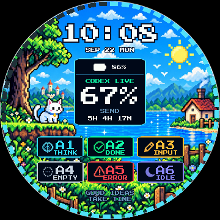

# Codex Micro for Waveshare ESP32-S3-Touch-LCD-1.85B



把 [digitsisyph/codex-micro-stopwatch](https://github.com/digitsisyph/codex-micro-stopwatch)
移植到 **Waveshare ESP32-S3-Touch-LCD-1.85B** 的原生 ESP-IDF 固件。
它把这块圆屏开发板变成 ChatGPT Desktop 的实体控制器：屏幕显示 Codex 状态、
额度、智能体和电池信息，触摸与 BOOT 键负责发送、选择智能体、语音和麦克风操作。

> 本项目是社区移植版，不是 OpenAI、M5Stack 或 Waveshare 的官方固件。

相关资料：[上游项目](https://github.com/digitsisyph/codex-micro-stopwatch) ·
[M5Stack StopWatch 文档](https://docs.m5stack.com/zh_CN/core/StopWatch) ·
[Waveshare 1.85B 文档](https://docs.waveshare.net/ESP32-S3-Touch-LCD-1.85B)

## 功能一览

- **360 × 360 像素仪表盘**：日夜主题、时钟日期、中央 5 小时额度、周额度外环、6 个智能体状态、连接健康度与完成提示。
- **ChatGPT Desktop 控制**：支持选择智能体、Send、四向滑动、Voice Chat 和 push-to-talk。
- **BLE HID + 私有遥测协议**：兼容 Codex Micro 的 JSON-RPC 分片协议，并上报真实电量。
- **按键配对模式**：长按 BOOT 3 秒断开链路、清除绑定并重新可配对（像耳机一样），
  继续按到 8 秒则换一个蓝牙地址重启，用于救回主机侧卡死的配对记录。
- **网页配网**：首次启动自动开放 `CODEX-XXXX` 热点，通过手机或电脑浏览器写入 Wi-Fi。
- **自动校时**：联网后通过 SNTP 获取时间，默认显示 UTC+8。
- **电源状态识别**：读取 BQ27220 电量计，区分电池供电、外部供电和充电状态。
- **完成提示音**：使用 ES8311 + I2S 播放任务完成提示。
- **Windows 额度伴生程序**：读取本机 Codex 的 5 小时与周额度，并通过 BLE 同步到表盘。
- **离线 UI 预览与回归工具**：无需烧录即可生成日间、夜间、离线、配网等界面截图。

## 快速开始

### 1. 准备环境

- Waveshare ESP32-S3-Touch-LCD-1.85B
- ESP-IDF 5.4 或更高版本（本仓库当前按 **v5.4.1** 验证）
- Python 3.10+
- Windows 10/11 + ChatGPT Desktop（需要使用实体控制功能和额度同步时）

仓库内的 `scripts/build/idf_env.bat` / `scripts/build/idf_env.sh` 使用的是当前开发机上的 ESP-IDF 路径。
如果你的安装位置不同，请先修改其中的 `IDF_TOOLS_PATH`、`IDF_PATH` 和
`IDF_PYTHON_ENV_PATH`。

下文所有 `python scripts/...` 请换成实际解释器的绝对路径。本机实测：

| 解释器 | `pyserial` | `Pillow` | 能跑 |
| --- | --- | --- | --- |
| `C:\Python312\python.exe` | ✅ | ✅ | **全部脚本**（推荐） |
| `D:\Espressif\python_env\idf5.4_py3.12_env\Scripts\python.exe` | ✅ | ❌ | 只有 `scripts/windows/` |

`scripts/assets/` 下的资产生成器依赖 Pillow，用 ESP-IDF 的解释器会直接报
`ModuleNotFoundError: No module named 'PIL'`。

### 2. 编译与烧录

Windows CMD 或 PowerShell：

```powershell
.\scripts\build\idf.bat build
.\scripts\build\idf.bat -p COM5 flash monitor
```

Git Bash：

```bash
source scripts/build/idf_env.sh
idf build
idf -p COM5 flash monitor
```

将 `COM5` 替换为开发板的实际串口。若修改过 `sdkconfig.defaults`，请先删除旧的
`sdkconfig`，再重新编译，让默认配置重新生效。

### 3. 首次配置 Wi-Fi

设备没有保存过 Wi-Fi，或连续连接失败时，会进入配网模式：

1. 在手机或电脑上连接屏幕显示的开放热点 `CODEX-XXXX`；
2. 浏览器打开 <http://192.168.4.1>；
3. 选择 2.4 GHz Wi-Fi，填写密码并保存；
4. 设备重启、联网并通过 SNTP 校时。

凭据只保存在设备 NVS 中，不会写入源码或提交到仓库。

### 4. 配对 Codex Micro

1. 打开 Windows“设置 → 蓝牙和设备 → 添加设备”；
2. 选择 **Codex Micro** 并完成配对；
3. 启动 ChatGPT Desktop，等待设备状态由离线变为可用；
4. 若旧固件曾与电脑配对，请先删除旧的 **Codex Micro** 记录再重新配对。

设备连接后仍显示“操作受限”时，先查看[BLE 排障手册](debug/ble-troubleshooting.md)，
不要直接清除整片 Flash 或修改蓝牙地址。

### 5. 同步 Codex 额度（Windows）

先查出设备的实际 BLE 地址：

```powershell
python scripts/windows/ble_scan.py
```

验证本机额度读取，然后持续同步：

```powershell
python scripts/windows/windows_companion.py --json-only -v
python scripts/windows/windows_companion.py --device-address xx:xx:xx:xx:xx:xx --watch --interval 60 -v
```

把示例地址替换为你的设备地址。伴生程序复用本机 Codex 登录态，不需要 OpenAI API Key，
也不会把账号凭据发送到开发板。

## ⚠️ 烧录固件之后：Windows 端必须做的事

**这一步不能跳过。** `idf.py flash` 会在电脑还连着的时候硬复位板子，把 Windows 的
GATT 枚举从中间打断；Windows 会留下一份"这块设备只有电量和配额"的残缺记录，之后
每次重连都拿它作答，**永远不去读 HID 服务**。结果就是蓝牙显示"已连接"、桌面端却
完全静默——它连设备都看不见。

**这个故障在固件里修不了**：板子一直在正常广播、绑定完好、属性表完整。所以改代码、
重烧多少次都不会好。判定和修复都只有一条命令（把下面的 `\` 换成单反斜杠）：

    python scripts/windows/ble_enum_guard.py        # 只读，几秒，退出码 0 = 正常
    python scripts/windows/ble_enum_guard.py --fix  # 报 partial / never-enumerated 时修好

`--fix` 会切换一次蓝牙无线电（等同"设置"里的开关，**不需要管理员**），
代价是几秒钟内所有蓝牙设备会断开一次（耳机、鼠标）。

### 标准流程

| # | 动作 | 期望结果 |
| --- | --- | --- |
| 1 | `scripts\build\idf.bat -p COM5 flash` | `Hash of data verified.` |
| 2 | 等板子起来（约 3 秒，屏幕出现表盘） | 串口 `ble: advertising as "Codex Micro"` |
| 3 | `python scripts\windows\ble_enum_guard.py` | `verdict : OK, the desktop app should be talking to it` |
| 4 | 第 3 步不是 OK 时加 `--fix` | 轮询到 `repaired: …` |
| 5 | 打开 ChatGPT Desktop → 设置 → Codex Micro | 不再是"已连接，功能受限"；按 BOOT 键桌面端有反应 |

板子串口"正常的样子"（连上之后 1~2 秒内就该出现 `RPC`）：

```text
I (…) ble: bond migration: stored=6 requested=6 read=ESP_OK bonds=1
I (…) ble: host connected id=0 bonds=1
I (…) ble: RPC method=v.oai.rgbcfg
I (…) ble: sendJson chunks=1 failed=0 bytes=32 cccd=0x0001
```

### 什么时候才需要重新配对

| 串口 / 主机侧 | 处理 |
| --- | --- |
| `ble_enum_guard.py` 报 `healthy`，但桌面端仍"功能受限" | 多半是桌面端的旧会话残留，重启桌面端即可 |
| 串口 `host connected` 但 `bonds=0` | 绑定两半不一致 → `python scripts\windows\windows_companion.py --repair-pairing -v`，再在设置里配对一次 |
| `ble_enum_guard.py` 连 `BTHLE\DEV_*` 都找不到 | 主机没见过这块板子 → 设置 → 蓝牙和其他设备 → 添加设备 → 选 **Codex Micro** |

> ⚠️ **不要**为了这个症状清整片 Flash、改 `kBondGeneration`、或关掉
> `CODEX_BLE_REQUIRE_ENCRYPTION`。这三件事都会把一个**主机侧**问题升级成
> **需要重新配对**的固件问题。完整判据、复现数据和踩过的坑见
> [`debug/ble-troubleshooting.md`](debug/ble-troubleshooting.md) 与
> [`debug/porting-log.md`](debug/porting-log.md)。
>
> 📁 `debug/`（调试过程）和 `logs/`（串口与伴生程序日志）**默认不提交 git**
> ——它们带着本机的串口号、蓝牙地址和用户名路径。所以新克隆的仓库里没有 `logs/`，
> `debug/` 里也只剩两份参考材料，上面两处链接会指向不存在的文件；`debug/` 的用途
> 和索引见 `debug/README.md`（本身只在本地）。
>
> `debug/` 里刻意留在仓库中的只有两份**参考材料**（`.gitignore` 白名单放行）：
> `reference/devcomm.js`（桌面端 `wl_device_comm` 的打包产物，第 4 节的分帧就是照它
> 核对的）和 `session-2026-09-25.md`（那两轮「连上但功能受限」的完整定位记录）。

## 常用配置入口

| 配置内容 | 文件 / 位置 | 默认值或说明 |
| --- | --- | --- |
| ESP-IDF、编译器与 Python 路径 | `scripts/build/idf_env.bat` / `idf_env.sh` | 当前开发机使用 ESP-IDF v5.4.1 |
| Flash、PSRAM、蓝牙、任务栈 | `sdkconfig.defaults` | ESP32-S3R8、16 MB Flash、8 MB Octal PSRAM |
| 屏幕、触摸、音频、按键引脚 | `main/board_config.h` | Waveshare 1.85B 官方 BSP 引脚映射 |
| 时区与 NTP 服务器 | `main/wifi_time.cpp` | UTC+8；双 NTP 服务器 |
| 亮度与自动息屏时间 | `main/main.cpp` | 电池：2 分钟变暗、5 分钟息屏；外部供电：10/30 分钟 |
| BLE 加密、绑定与调试日志 | `main/codex_ble.cpp` | `CODEX_BLE_REQUIRE_ENCRYPTION`（默认 1）、`CODEX_BLE_TRACE`（默认 0）、`CODEX_BLE_BOND_REVISION`（默认 6；只在 NVS 里记录的版本更低时触发一次，已自失效）、`CODEX_BLE_SECURITY_ON_CONNECT`（默认 0） |
| UI 布局、颜色和文案 | `main/dashboard_ui.h` | 360 × 360 圆屏布局 |
| 日夜背景与电池图标 | `main/assets/`、`main/Backgrounds.h`、`main/BatteryIcons.h` | 由 `scripts/assets/make_*.py` 生成 |
| 额度同步周期与重试 | `scripts/windows/windows_companion.py` 命令行参数 | `--interval`、`--write-attempts`、`--write-timeout-ms` |

生成所有离线预览：

```powershell
python scripts/assets/pixel_preview.py --scene all
```

下面是硬件、协议、实现和排障的完整说明。

---

## 1. 硬件对照

| 项目 | C152 StopWatch Dev Kit | Waveshare 1.85B | 移植处理 |
| --- | --- | --- | --- |
| SoC | ESP32-S3R8 | ESP32-S3R8 | 相同，240 MHz / 8 MB Octal PSRAM / 16 MB Flash |
| 屏幕 | 466×466 CO5300 AMOLED | 360×360 ST77916 QSPI | 仪表盘按比例重排为 360×360 |
| 触摸 | CST9217 | CST816S | `espressif/esp_lcd_touch_cst816s` |
| 按键 | 左键 + 右键 + 红色电源键 | **仅 BOOT (GPIO0)** | 单键多手势，见第 4 节 |
| 电源 | M5PM1 PMIC | BQ27220 电量计 | 无 PMIC、无轨道断电 |
| 音频 | 内置喇叭 | ES8311 + I2S 功放 | 寄存器级 ES8311 驱动 |
| 震动马达 | 有 | 无 | 移除触觉反馈 |

### 引脚映射

| 功能 | GPIO |
| --- | --- |
| LCD CS / PCLK / D0 / D1 / D2 / D3 | 21 / 40 / 46 / 45 / 42 / 41 |
| LCD RST / 背光 | 3 / 5（LEDC CH1） |
| I2C SCL / SDA | 10 / 11（400 kHz，共享总线） |
| 触摸 RST / INT | 1 / 4 |
| I2S MCLK / BCLK / LRCK / DOUT / DIN | 2 / 48 / 38 / 47 / 39 |
| 功放使能 | 9 |
| 用户按键（唯一） | 0（BOOT，strapping 引脚） |

I2C 从机地址：ES8311 `0x18`（7 位；BSP 里写的 `0x30` 是 8 位形式）、BQ27220 `0x55`、CST816S `0x15`。

---

## 2. 显示与界面

- ST77916 QSPI，360×360，RGB565，80 MHz。上电先读寄存器 `0x04` 判断面板版本，
  再选用对应的厂商初始化表（v1 / v2）。
- 帧缓冲放在 PSRAM（259 KB），按 60 行一条分 6 条推屏，DMA 完成后由回调释放信号量。
- 布局（`main/dashboard_ui.h`）：
  - 中心 `(180, 180)`，外圈配额环半径 80 px；
  - 6 个智能体键均布在半径 42 px 的圆周上，角度 60° 间隔；
  - 配色：背景 `#000000`，正文 `#E8EEF5`，次要 `#7D8A98`，强调 `#12D6B2`。

---

## 3. 交互语义（与 C152 完全一致）

### 触摸

| 手势 | 动作 | 发往宿主的 JSON-RPC |
| --- | --- | --- |
| 点按 6 个智能体键 | 选中智能体 | `v.oai.hid` `{k:"AG00".."AG05", act:1, ag:i}` 再 `act:0` |
| 点按中央 Send | 发送 | `v.oai.hid` `{k:"ACT12", act:1}` 再 `act:0` |
| 向 4 个方向滑动 | 摇杆 | `v.oai.rad` `{a:角度, d:1.0}` 按下 / `{a:角度, d:0.0}` 松开 |
| 长按 Send ≥ 2 s | 显示关机进度 | — |
| 长按 Send ≥ 6 s | 熄屏（关机态） | — |

### 唯一的物理按键：BOOT (GPIO0)

**本板只有一个可定义按键**，因此全部手势都集中在它上面：

| 手势 | 动作 | 发出 |
| --- | --- | --- |
| **单击** | 息屏 / 唤醒（desk sleep 切换）；屏幕亮着时是 Send | — / `ACT12` |
| **双击** | Voice Chat 短按（对应 C152 右键） | `ACT09` 按下 → 70 ms → 松开 |
| **长按 ≥ 700 ms** | 麦克风对讲 push-to-talk（对应 C152 左键） | `ACT10` 按下，松手时 `ACT10` 松开 |
| **长按 ≥ 3 s** | **进入蓝牙配对模式**（断开链路 + 清除全部绑定 + 重新可配对） | — |
| **长按 ≥ 8 s** | **换一个蓝牙地址重启**（升级手段，见第 4.2 节） | — |

三点说明：

1. **没有独立电源键**。C152 的红色电源键功能改由触摸承担（长按 Send 6 s）。
2. **不使用 deep sleep**。唯一的用户按键 GPIO0 是 ROM 下载 strapping 引脚，
   deep sleep 唤醒会重新采样该引脚，可能把芯片带进串口下载模式而不是应用程序。
3. 因此"关机"是**背光关闭的空闲态**（屏幕黑、CPU 低频轮询），不是真正的断电。

> 长按的四个阈值是**累积**的：按住不放会依次经过 700 ms（麦克风按下）、
> 3 s（释放麦克风并进入配对模式）、8 s（换地址重启）。所以想进配对模式，
> 按到屏幕出现 `PAIR` 再松手即可；只想对讲就按到出现 `LISTENING` 就松手。

---

## 3.1 蓝牙配对模式（长按 BOOT 3 秒）

这是本工程为"连上了但不能操作"准备的**按键级自救手段**，等价于按住耳机上的
配对键：不需要串口、不需要重新烧录、也不需要 Windows 的设备管理器。

| 步骤 | 设备侧 | 主机侧 |
| --- | --- | --- |
| 1 | 长按 BOOT 到屏幕出现 `BLUETOOTH / PAIR / CODEX MICRO` | — |
| 2 | 自动断开当前链路，清掉 NVS 里的全部绑定，重新开始可配对广播 | 打开"设置 → 蓝牙和其他设备 → 添加设备" |
| 3 | 屏幕显示 `118S LEFT` 倒计时（窗口 120 秒） | 选择 **Codex Micro** 完成配对 |
| 4 | 收到连接后自动退出配对模式，恢复仪表盘 | 启动 ChatGPT Desktop |

行为细节：

- **窗口 120 秒**。超时后自动回到普通状态（重新开始普通广播），不会一直停在
  可配对态。
- **配对窗口内屏幕不休眠**：设备正在被使用，熄屏会让用户看不到提示。
- **连接即成功退出**：只要主机连上来（无论是否完成配对），提示自动收起。
- **8 秒是升级手段**：继续按住到 8 秒，设备会把蓝牙地址的代次 +1 写入 NVS 并
  重启，广播一个**主机从未见过的新地址**。这是 `debug/porting-log.md` 的 6.13 / 6.16 里那个"记录还在、
  报未配对、又拒绝重新配对"死锁的解法，原先只能改代码重烧，现在按键即可触发。
  代价是主机把它当成全新设备，**必须重新配对一次**。
- 串口日志会明确记录动作，便于确认：

  ```
  W (…) app: BUTTON hold action=bond_generation_reset hold=8123ms
  W (…) ble: pairing mode: dropped 2 bond(s), signalled 1 link(s), advertising=1
  W (…) ble: bond generation 0x5D -> 0x5E (2 bond(s) dropped); restarting …
  ```

> ⚠️ 屏幕熄灭（desk sleep）时按键的第一下只用于唤醒，不会触发配对模式。
> 先点亮屏幕，再长按。

---

## 4. 蓝牙（BLE）协议

Bluedroid 直接注册 GATTS/GAP（原版用的是 Arduino-ESP32 的 BLE 封装）。

| 服务 | UUID | 内容 |
| --- | --- | --- |
| Device Information | `0x180A` | 制造商 "Work Louder"、PnP ID `303A:8360` |
| HID over GATT | `0x1812` | 厂商报告 ID **6**，usage page `0xFF00`，报告体 63 字节 |
| Battery Service | `0x180F` | 电量通知 |
| 私有配额服务 | `7f0d4e66-2ac2-4a71-bfbe-4ef61a0e5c01` | 写入特征 `...5c02` |

设备名 `Codex Micro`，广播里带 `0x1812` / `0x180F` / 128 位配额服务 UUID。

### JSON-RPC 传输

走 **HID output report**，分片格式：

```
report[0] = 0x02
report[1] = 本次载荷长度
report[2..] = 载荷（换行符结尾，每片最多 61 字节）
```

- 入站方法：`sys.version`、`device.status`、`v.oai.thstatus`、`v.oai.rgbcfg`、
  `lights.preview`、`host.focused_app`
- 出站方法：`v.oai.hid`（`ACT09` / `ACT10` / `ACT12` / `AG00`..`AG05`）、
  `v.oai.rad`（摇杆）

写入默认要求加密链路。首次配对调试时可以用
`-DCODEX_BLE_REQUIRE_ENCRYPTION=0` 先建立明文链路。

### ⚠️ 首次使用必须让主机重新配对

配额特征 `...5c02` 与 HID 报告特征都是**加密访问**，所以链路必须先完成配对。

**配对状态是这条链路里最脆的一环。** 绑定有两半：主机按地址存一半，板子按对端地址存一半。
任一侧重新烧录、擦 NVS 或换地址，两半就对不上。表现不是「连不上」，而是
**「连上了，但 Codex 里显示『已连接，功能受限』，要等十来分钟才好」**：

```text
I (5011) ble: connected peer e0:0a:f6:80:71:d2
I (5011) ble: host connected id=0 bonds=0      ← 板子这半是空的，主机那半还在
```

链路建得起来，但永远不加密；桌面端第一次 HID 写入被本地拒掉
（`hid_write/GetOverlappedResult: (0x00000057)`），于是显示功能受限。
Windows 会自己修这条记录，但**按它自己的节奏**——本机实测 **9 分 40 秒**。

第一次使用请：

1. Windows：设置 → 蓝牙和其他设备 → **添加设备** → 选择 **Codex Micro**，完成配对；
2. 如果列表里还留着旧的 **Codex Micro** 条目（连不上的那条），顺手删掉即可；
3. 配对完成后串口会打印 `ble: pairing complete`，之后链路会一直保持。

已经连过一次、绑定正常的情况下不需要做这些，断电重连会自动恢复。

> **本工程不会再自动清绑定。** 早期版本用「绑定代次迁移」（`kBondRevision`）在启动时
> 清空板子这半的绑定，想借此逼主机重新配对——结果是每烧录一次就把用户已经配好的绑定毁一次，
> 正是「重启后又失效」的来源。现在 `CODEX_BLE_BOND_REVISION` 虽然写着 `6`，但它是
> **一次性**的：版本号写进 NVS 之后，`stored >= requested` 就直接返回，**常规烧录不会
> 再触发**。只有把它改成比 NVS 里已存值更大的数并重编译，才会再清一次。
> 详见 `debug/porting-log.md` 6.17。

### 调试开关

| 开关 | 位置 | 作用 |
| --- | --- | --- |
| `CODEX_BLE_REQUIRE_ENCRYPTION` | `main/codex_ble.cpp` | 置 0 可让 HID / 配额特征接受明文读写，用于排除配对问题 |
| `CODEX_BLE_TRACE` | `main/codex_ble.cpp` | 置 1 并开启 `CONFIG_LOG_MAXIMUM_LEVEL_DEBUG`，打印 HCI / SMP / ATT 细节 |
| `CODEX_BLE_BOND_REVISION` | `main/codex_ble.cpp` | 默认 `6`，但**一次性**：只在 NVS 里记录的版本更低时清一次绑定，之后自失效。**常规烧录请勿改动** |
| `CODEX_BLE_SECURITY_ON_CONNECT` | `main/codex_ble.cpp` | 默认 `0`。置 1 会在连接事件里发 SMP Security Request——**实测更糟**，见 `debug/porting-log.md` 6.17 |

---

## 5. 构建与烧录

本工程用的是本机已装好的 ESP-IDF v5.4.1，未新增任何环境。

```bash
# 1) 载入 IDF 环境（脚本只做 PATH / 变量设置，不安装任何东西）
source scripts/build/idf_env.sh

# 2) 编译
idf build

# 3) 烧录（把 COM5 换成实际串口）
idf -p COM5 flash

# 4) 看日志
idf -p COM5 monitor
```

`scripts/build/idf_env.sh` 里做了两件必要的适配：

- PATH 条目刻意使用 Windows 反斜杠形式 —— MSys 会重写 POSIX 形式的条目，
  把 `D:/Espressif/...` 破坏成错误的相对路径；
- `scripts/build/idf_runner.py` 在启动 `idf.py` 前剔除 `MSYSTEM` / `MINGW_*`，
  否则 `idf.py` 会因为检测到 MSys 而拒绝启动。

### 关键配置（`sdkconfig.defaults`）

| 配置 | 值 | 原因 |
| --- | --- | --- |
| `CONFIG_ESP_MAIN_TASK_AFFINITY_CPU1` | y | 主任务与蓝牙栈分核，见 `debug/porting-log.md` |
| `CONFIG_ESP_MAIN_TASK_STACK_SIZE` | 12288 | 全屏绘制栈需求较大 |
| `CONFIG_BT_CTRL_LE_PING_EN` | **n** | 关闭认证载荷超时，见 `debug/porting-log.md` |
| `CONFIG_BT_SMP_MAX_BONDS` | 8 | 配对信息存 NVS |
| `CONFIG_BT_STACK_NO_LOG` | n | 保留控制器告警，便于排障 |
| `CONFIG_ESP_CONSOLE_USB_SERIAL_JTAG` | y | 用原生 USB-C 口看日志 |

> ⚠️ 改了 `sdkconfig.defaults` 之后请**删掉 `sdkconfig` 再编译**。
> ESP-IDF 只在生成新 `sdkconfig` 时套用 defaults，已存在的 `sdkconfig`
> 会覆盖 defaults，这正是下面 `debug/porting-log.md` 6.4 那个 bug 的成因。

---

## 6. 已知限制

- **没有震动马达**：C152 的触觉反馈无法移植。
- **"关机"不是真关机**：本板没有 PMIC，无法切断电源轨；熄屏态仍在耗电。
- **不使用 deep sleep**：原因见第 3 节（GPIO0 是 strapping 引脚）。
- **不使用 light sleep**：原因见 `debug/porting-log.md` 6.7（XIP from PSRAM + 未启用 PM 框架）。
- **唤醒/熄屏由单键承担**，因此单击是 desk sleep 切换，不能再用作其他用途。
- **已连接时不再广播**（`debug/porting-log.md` 6.5 的修复）。如果确实需要伴侣设备同时建立第二条
  连接，要重新设计广播策略，不能简单地在连接事件里重启广播。
  **可观察到的后果**：ChatGPT 桌面端正常连着的时候，它独占这条链路，
  `scripts/windows/windows_companion.py` 会一直报 `the GATT session never became Active;
  the board is not connectable right now` —— 这不是额度读取失败
  （`--json-only` 照样读得到），而是板子没在广播，第二个中心设备进不来。
  额度写入要在桌面端没占链路的时候做。

---

## 7. 解析崩溃地址

日志里出现 `Backtrace: 0x... 0x...` 时：

```bash
export PATH="/d/Espressif/tools/xtensa-esp-elf/esp-14.2.0_20241119/xtensa-esp-elf/bin:$PATH"
xtensa-esp32s3-elf-addr2line -pfiaC -e build/codex_micro_1_85b.elf \
  0x42031317 0x42012899 0x4202e24d
```

---

## 8. 目录结构

```
codex-micro-1.85b/
├── CMakeLists.txt          ESP-IDF 工程入口                              ┐
├── partitions.csv          nvs / otadata / phy_init / factory(4 MB)     │
├── sdkconfig / sdkconfig.defaults   当前配置与基线（改 defaults 请删    │ 芯片烧录代码
├── dependencies.lock       sdkconfig 后重新编译）                       │
├── main/                   固件源码（见下）                              ┘
│
├── scripts/                脚本（提交 git，见 scripts/README.md）
│   ├── build/              IDF 环境与启动器
│   │   ├── idf_env.sh / idf_env.bat   Git Bash / CMD 下的环境设置
│   │   ├── idf.bat                    CMD 一键 build / flash
│   │   ├── idf_runner.py              剔除 MSYS 标记后转交 idf.py
│   │   └── idf_build.py               Git Bash 下的另一条等价路径
│   ├── windows/            Windows 端：BLE 诊断 / 额度同步 / 串口
│   │   ├── windows_companion.py       额度伴生程序（读额度 + 写 BLE 特征）
│   │   ├── test_windows_companion.py  伴生程序单元测试
│   │   ├── ble_enum_guard.py          ★ 烧录后先跑这个：判 + 修主机枚举
│   │   ├── ble_scan.py / ble_devices.py   列出主机已知的 BLE 设备
│   │   ├── ble_host_diag.py           PnP 节点与配对记录诊断
│   │   ├── bt_power_repair.py         网卡"允许关闭以省电"（需管理员）
│   │   ├── bt_radio_toggle.py         蓝牙无线电开 / 关（治主机栈假死）
│   │   ├── bt_pair.py / bt_reconnect.py   命令行配对 / 催主机重连
│   │   ├── hid_caps.py                查 HID 能力，可 --write-test 真写一帧
│   │   ├── hid_rpc.py                 绕开桌面端直接发一条 RPC
│   │   ├── codex_host_state.py        桌面端进程与网卡电源策略
│   │   └── boot_capture.py / serial_*.py  复位抓串口 / 普通抓取
│   ├── assets/             图标 / 字体 / 背景 / 离线预览
│   │   ├── make_backgrounds.py / make_battery_icons.py
│   │   ├── make_icon_textures.py / make_icons*.py / make_pixel_font.py
│   │   ├── apply_ui_assets.py         UI 换肤一键入口（本地工具，不提交）
│   │   ├── dial_preview.py / pixel_preview.py   离线表盘渲染
│   │   ├── fonts/                     生成像素字体的 TTF
│   │   └── preview/                   背景与预览 PNG
│   └── companion/          额度伴生程序的一键菜单与登录自启
│       ├── menu.cmd / menu.ps1        交互式菜单
│       ├── install-autostart.ps1      注册登录计划任务
│       ├── start / stop / status-companion.ps1
│       └── config.psd1                地址 / 周期 / 超时
│
├── debug/                  调试过程（**默认不提交 git**；★ 两份参考材料例外）
│   ├── README.md           索引：按现象查                                    ┐
│   ├── porting-log.md      移植踩坑 6.1–6.17（原 README 第 6 章）            │
│   ├── ble-troubleshooting.md  BLE 排障手册 7.1–7.5（原 README 第 7 章）     │ 本地
│   ├── ui-replace.md       UI 换肤契约                                      │
│   ├── tmp/                历史素材与草稿                                    ┘
│   ├── ★ session-2026-09-25.md   两轮"连上但功能受限"的完整定位记录  ┐ 提交
│   └── ★ reference/devcomm.js    桌面端 wl_device_comm 打包产物，    │ git
│                                用来逐字节核对 HID 分帧（见第 4 节）  ┘
│
├── logs/                   日志（**不提交 git**）
│   ├── serial/             串口抓取（boot*.log / cap_*.log / trace*.log）
│   └── companion/          伴生程序每日运行日志
│
└── main/
    ├── main.cpp            应用主体：状态机、手势、电源策略、主循环
    ├── codex_ble.cpp/.h    Bluedroid GATTS/GAP + JSON-RPC 收发
    ├── dashboard_ui.h      360×360 仪表盘绘制
    ├── gfx.cpp/.h          PSRAM 帧缓冲、抗锯齿图元、VLW 字体
    ├── display.cpp/.h      ST77916 QSPI 初始化 / 分条推屏 / 背光
    ├── touch_input.cpp/.h  CST816S 触摸
    ├── board_i2c.cpp/.h    共享 I2C 总线
    ├── battery.cpp/.h      BQ27220 电量计
    ├── chime.cpp/.h        ES8311 + I2S 完成提示音
    ├── logic.h             纯逻辑移植（连接健康度 / RPC 分类 / 配额 / 手势）
    └── SpaceMonoVlw.h      VLW 字体数据（由原工程原样复制）
```

---

## 9. Windows 额度伴生程序（`windows_companion.py`）

上游的额度来自 **macOS Swift 伴生程序**，它启动本地 `codex app-server`，
用 JSON-RPC 读额度，再通过 BLE 私有特征写到表上。
`windows_companion.py` 是这条链路的 **Windows 等价实现，额度获取部分完全等价**：
`codex` CLI 本身是跨平台的，`codex app-server` 在 Windows 上照样跑。

### 额度是怎么来的

默认先走**本机快路径**，失败才落到 App Server：

```
① http://127.0.0.1:8787/quota      ← 本机已运行的额度服务（若有），毫秒级返回
   ↓ 把 primary/secondary 两个窗口重排成 App Server 的形状
② codex app-server --listen stdio://  ← 本机 codex CLI，复用已有登录态（兜底）
   ↓ JSON-RPC（换行分隔）
initialize → initialized → account/read → account/rateLimits/read
   ↓ 同时取 300 / 10080 分钟窗口（按 windowDurationMins 认，不按 slot 名认）
{"five_hour_remaining_percent":84,"five_hour_reset_in_seconds":13700,
 "weekly_remaining_percent":62,"weekly_reset_in_seconds":600373}
   ↓ BLE 写入
7f0d4e66-...-5c02  →  表盘刷新
```

**为什么要有 ①**：App Server 每次都要现拉一个 Node CLI，实测约 5 秒；而已在运行的
本机服务是 HTTP 秒回。① 的结果会**重排成 App Server 的结构**再交给同一个
`build_snapshot()`，两个窗口都按时长选择，因此两个来源不会对窗口含义产生分歧。

`--no-bridge` 可以强制走 ②；`--bridge-url` 换地址。地址不通时会自动回落到 ②，
不会因此失败。

不读凭据、不抓 UI、不走云端中转、不需要 OpenAI API Key，账号 token 也不落到表上。

> 注意：额度取回之后，**慢的那一段其实是 BLE 写入重试**，不是取额度。
> 写入失败的根因是链路每 32.88 秒被拆（见 `debug/porting-log.md` 6.14），所以先做电源管理那一步。

### 用法

```bash
# 只验证额度获取，完全不碰蓝牙（排障第一步）
python scripts/windows/windows_companion.py --json-only -v

# 列出 Windows 已知的 BLE 设备，确认板子在不在里面
python scripts/windows/ble_scan.py

# 配对卡死时（板子在 Windows 里报未配对、又连不上）
python scripts/windows/windows_companion.py --device-address $BOARD --repair-pairing -v

# 探测目标板是否暴露额度服务（不写入）
python scripts/windows/windows_companion.py --device-address $BOARD --probe-only -v

# 写一次
python scripts/windows/windows_companion.py --device-address $BOARD --once -v

# 持续刷新（每 60 秒）
python scripts/windows/windows_companion.py --device-address $BOARD --watch --interval 60 -v
```

`--device-address` 是板子**实际广播**的 BLE 地址，必须显式指定；程序按地址精确
寻址，不做名字匹配、不做广播扫描。

> ⚠️ **不要**从启动日志里抄地址：那行打印的是**基址 MAC**，广播地址是基址 + 2。
> 改过 `kBondGeneration` 之后地址也会变。可靠的做法是在 Windows 里配对成功后，
> 从 `scripts/windows/ble_scan.py` 或 `--repair-pairing` 的输出里读。

### 可靠性相关的开关

| 开关 | 默认 | 作用 |
| --- | --- | --- |
| `--write-attempts N` | 4 | 写入失败时重试次数。每次重试都是全新进程 → 全新 GATT 会话，专治 `ERROR_CANCELLED` |
| `--write-timeout-ms N` | 12000 | 单次写入超时。**不要调回 30000**：30 秒的卡死会把板子推进 `ESP_GATT_CONGESTED`（见 `debug/porting-log.md` 6.11） |
| `--repair-pairing` | — | 独立模式：解绑后重新配对，用于清理主机侧的陈旧绑定。会改动本机蓝牙状态，所以不会隐式触发（见 `debug/porting-log.md` 6.13） |

生产用法建议 `--watch`：每个周期都是一次独立尝试，某一轮撞上 HID 主机
占用链路（板子日志里能看到 `RPC method=v.oai.thstatus` 与失败的写同时出现）
下一轮自然会补上，不需要人工干预。

### 依赖

**零第三方包**。BLE 走 `powershell.exe` 调用 WinRT（反射 `AsTask` 桥），
所以不需要装 `bleak`。跑 `--json-only` 只需要本机有 `codex` CLI。

> 写入失败的排查顺序：先 `--json-only` 确认额度读得到，再 `--probe-only`
> 确认服务发现是 `Success`，最后才 `--once`。三层里哪一层先报错，
> 问题就在哪一层。`WinError 206` 见 `debug/porting-log.md` 6.9，间歇性写入失败见 `debug/porting-log.md` 6.11。

> 板子侧的对照方法：抓 COM5 串口。成功一定伴随
> `ble: quota update 5h=… reset=…s weekly=… reset=…s`，且两组值必须等于
> 载荷里的 5 小时/周额度字段。看不到这一行就说明 PDU 根本没到板子，
> 问题在主机侧，不要去改固件。

---

## 10. 许可

沿用上游项目：MIT。
